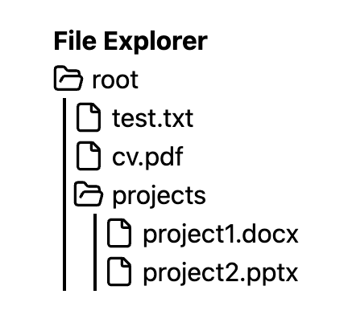
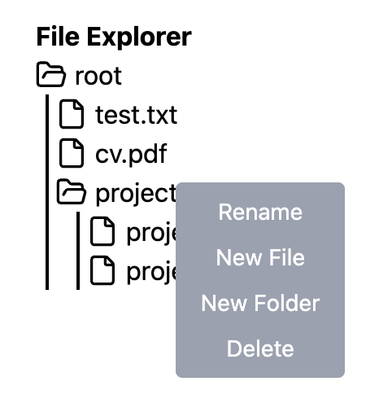

# React File Explorer

A VS Code-style file explorer built entirely by hand in React + TypeScript — no AI, no tutorials, no component libraries.

 

---

## Purpose

This project was built as a deliberate practice exercise to understand how non-trivial UI components work at a fundamental level.

The goal was to write something real from scratch — no shortcuts — and be able to explain every single line.

---

## What It Does

- **Recursive tree rendering** — folders can be nested infinitely deep; one component handles every level
- **Collapsible folders** — click to open/close; closed folders are removed from the DOM entirely (not just hidden)
- **Dynamic icons** — file, closed folder, and open folder icons that update on interaction
- **Right-click context menu** — appears at cursor position, dismisses on outside click
- **Add files and folders** — right-click any folder to add a child file or folder by name
- **Delete nodes** — right-click any node to remove it (recursively removes nested children)
- **Drag and drop** — drag any file or folder into another folder to move it

---

## Concepts Practiced

**Recursive components**
`TreeNode` renders itself inside itself. A folder maps over its children and renders a `<TreeNode>` for each one. This is how any depth of nesting works automatically with a single component.

**Recursive state mutations**
`deleteNode` and `addNode` are pure recursive functions that walk the tree and return a new tree. No mutation — React state is always replaced with a new object.

**useState for local UI state**
Each `TreeNode` manages its own `isOpen` boolean independently. Parent components don't know or care which folders are open.

**useEffect for global listeners**
The context menu closes when you click anywhere on the page. That requires a `document.addEventListener` on mount and cleanup (`removeEventListener`) on unmount.

**Drag and drop via HTML5 API**
`onDragStart`, `onDragOver`, and `onDrop` events track which node is being dragged and which folder it's being dropped into. On drop: delete the node from its old position, insert it into the new parent.

**TypeScript discriminated unions**
`FileNode` and `FolderNode` are separate types with a shared `type` field (`'file'` vs `'folder'`). TypeScript narrows the type automatically inside `if (node.type === 'folder')` checks — no casting needed.

---

## Stack

- React 18
- TypeScript
- Tailwind CSS
- Lucide React (icons)
- Vite

---

## Run Locally

```bash
npm install
npm run dev
```

---

## Why This Matters

Anyone can prompt an AI to generate a file explorer. Building it by hand forces you to actually understand:

- Why recursive data structures need recursive components
- Why immutable state updates matter in React
- How browser events bubble and why `stopPropagation` is sometimes necessary
- How to model UI state — what goes in local state vs lifted state
